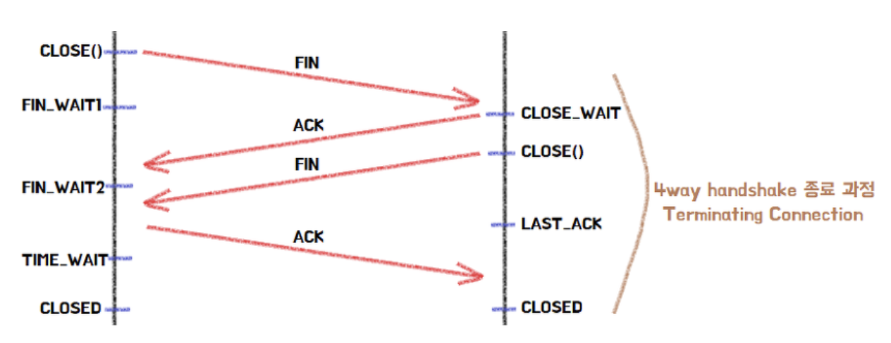
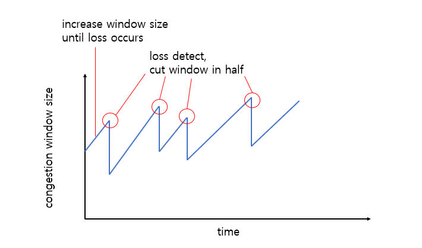
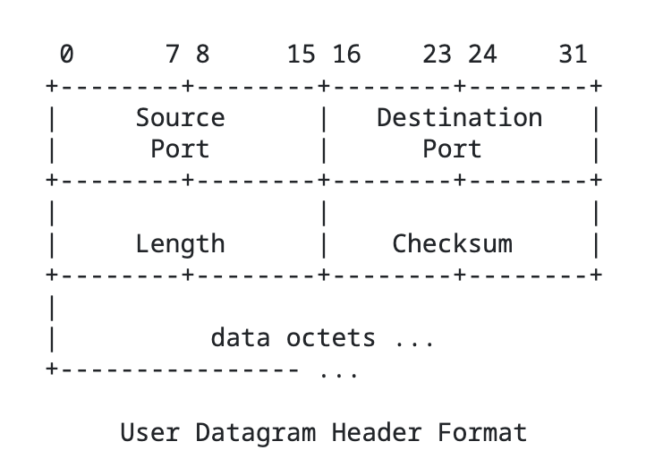

# TCP/IP

TCP, IP 는 모두 프로토콜의 일종이다. 

> 💡**프로토콜은 무엇인가?** 
> 
>  프로토콜은 컴퓨터 내부에서, 또는 컴퓨터 사이에서 데이터의 교환 방식을 정의하는 규칙 체계입니다. 기기 간 통신은 교환되는 데이터의 형식에 대해 상호 합의를 요구합니다. 이런 형식을 정의하는 규칙의 집합을 프로토콜이라고 합니다.
> 
> 출처 : MDN

## TCP

OSI 7 계층 중 전송 계층에서 활용되는 프로토콜 중 하나이다. 3계층의 IP 프로토콜과 함께 쓰이는 경우가 많아 TCP/IP 로 표현하기도 한다. 

### TCP 특징

- 신뢰성: 패킷 손실·오류를 감지하고 재전송을 통해 복구합니다.
- 순서 보장: 바이트 스트림 단위로 순서를 유지하여 전송합니다.
- 연결 지향적: 3-way handshake로 연결을 설정하고, FIN 교환으로 종료합니다.
- 양방향 통신: 한 연결에서 양방향 데이터 흐름을 지원합니다.
- 포트 기반 다중화: IP 주소 + 포트 번호 조합으로 애플리케이션을 식별합니다.

### TCP 세그먼트 

- 시퀀스 번호(Sequence Number): 데이터의 순서를 추적
- ACK 번호(Ack Number): 다음으로 기대하는 바이트 번호
- 플래그(Flags): SYN, ACK, FIN, RST, PSH, URG, ECE, CWR
- 윈도우(Window): 수신 측이 허용 가능한 데이터 크기
- 체크섬(Checksum): 헤더·데이터 오류 검출용 (항상 필수)

### 3-way Handshake

3-way Handshake는 송신측과 수신측 모두 데이터를 주고 받을 준비가 되어있음을 확인하고, 패킷 순서와 신뢰성을 보장할 수 있는 초기 상태를 맞추는 과정이다. 

### 4-way Handshake

4-way Handshake는 TCP 연결을 종료하는 과정이다. 양측이 FIN 플래그를 교환하여 연결 종료를 확인한다.

> 💡**TCP는 왜 신뢰할 수 있는가?**
> 
> - Checksum 을 통해서 손상을 방지
> - 흐름 제어(수신 윈도우, ZWP, 윈도우 스케일링)로 수신 버퍼를 보호
> - 혼잡 제어(RTO 추정, Selective ACK)를 통해 네트워크 혼잡에도 대응
> - 초기 시퀸스 번호르 양측이 교환해 예전 연결의 세그먼트가 현재 연결을 오염시키지 않도록 함
> - 연결 종료 후에도 잠시 대기하여 지연 도착 세그먼트가 다른 연결에 섞이지 않게 격리

**TCP 혼잡 제어 알고리즘 > AIMD(Additive Increase Multiplicative Decrease)**

### TCP vs UDP

> 💡**최근 UDP 가 주목받는 이유는 무엇인가?**
> 
> 통신 기술의 발달(5G, Wi-Fi) -> 큰 데이터 전송 가능 -> UDP 프로토콜을 사용하여 데이터 전송
> 대표적으로 Youtube, Netflix 와 같은 스트리밍 서비스가 UDP 기반으로 동작
> 
> HTTP 2.0 에서는 TCP 기반으로 동작하기 때문에 HOLB(Head of Line Blocking) 문제가 발생
> 구글이 이를 해결하기 위한 UDP 기반의 QUIC 프로토콜을 개발
> HTTP 2.0 에서 존재하던 문제점을 대부분 해결, RTT(Round Trip Time) 제로 수준으로 줄이고, 패킷 손실에 대한 빠른 대응, 사용자 IP 가 바뀌어도 연결이 유지

| 항목        | TCP                      | UDP                |
| --------- | ------------------------ | ------------------ |
| **연결 여부** | 연결형 (3-way handshake 필요) | 비연결형 (바로 전송)       |
| **신뢰성**   | 패킷 순서·재전송 보장             | 보장하지 않음            |
| **속도**    | 느림 (검증 절차 많음)            | 빠름 (검증 절차 없음)      |
| **용도**    | 파일 전송, 이메일, 웹 등          | 스트리밍, 게임, 실시간 통신 등 |
| **헤더 크기** | 20바이트 이상                 | 8바이트               |

### References

- https://datatracker.ietf.org/doc/html/rfc9293
- https://inpa.tistory.com/entry/WEB-%F0%9F%8C%90-TCP-IP-%EC%A0%95%EB%A6%AC-%F0%9F%91%AB%F0%9F%8F%BD-TCP-IP-4%EA%B3%84%EC%B8%B5
- https://docs.tosspayments.com/resources/glossary/tcp#tcp-%ED%86%B5%EC%8B%A0-%EA%B3%BC%EC%A0%95
- https://code-lab1.tistory.com/30
- https://inpa.tistory.com/entry/NW-%F0%9F%8C%90-%EC%95%84%EC%A7%81%EB%8F%84-%EB%AA%A8%ED%98%B8%ED%95%9C-TCP-UDP-%EA%B0%9C%EB%85%90-%E2%9D%93-%EC%89%BD%EA%B2%8C-%EC%9D%B4%ED%95%B4%ED%95%98%EC%9E%90